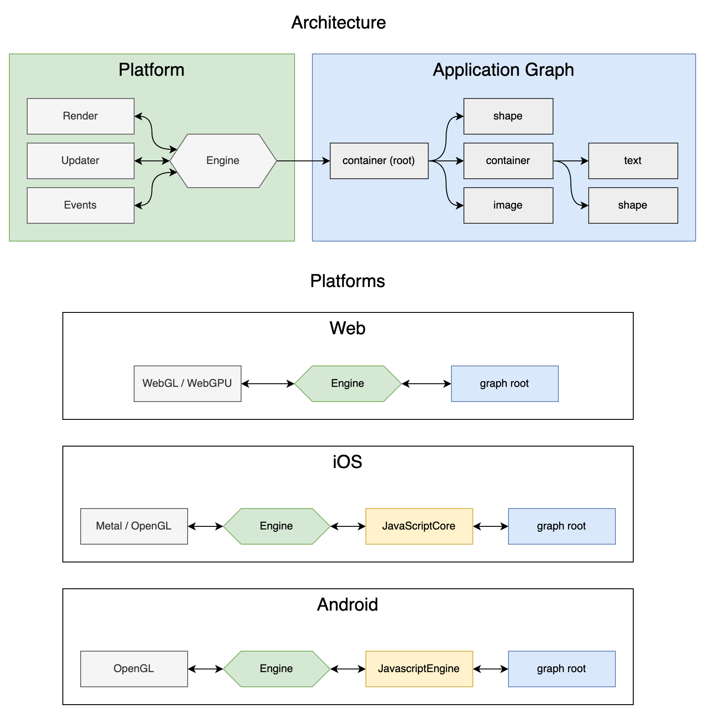

# jeng (JavaScript Graphics Engine)
Flexible graphics engine written on TypeScript.

## Samples
- Hello World [Code](https://github.com/AntonovSergey2211/jeng/blob/master/samples/hello-world/src/index.ts) / [Build](https://antonovsergey2211.github.io/jeng/samples/hello-world/build/)

- Image simple [Code](https://github.com/AntonovSergey2211/jeng/blob/master/samples/image-simple/src/index.ts) / [Build](https://antonovsergey2211.github.io/jeng/samples/image-simple/build/)

- Image color sample [Code](https://github.com/AntonovSergey2211/jeng/blob/master/samples/image-color/src/index.ts) / [Build](https://antonovsergey2211.github.io/jeng/samples/image-color/build/)

- Image transform sample [Code](https://github.com/AntonovSergey2211/jeng/blob/master/samples/image-transform/src/index.ts) / [Build](https://antonovsergey2211.github.io/jeng/samples/image-transform/build/)

- Simple text sample [Code](https://github.com/AntonovSergey2211/jeng/blob/master/samples/text-simple/src/index.ts) / [Build](https://antonovsergey2211.github.io/jeng/samples/text-simple/build/)

- Advanced text sample [Code](https://github.com/AntonovSergey2211/jeng/blob/master/samples/text-advanced/src/index.ts) / [Build](https://antonovsergey2211.github.io/jeng/samples/text-advanced/build/)

- Simple shape sample [Code](https://github.com/AntonovSergey2211/jeng/blob/master/samples/shape-simple/src/index.ts) / [Build](https://antonovsergey2211.github.io/jeng/samples/shape-simple/build/)

- Advanced shape sample [Code](https://github.com/AntonovSergey2211/jeng/blob/master/samples/shape-advanced/src/index.ts) / [Build](https://antonovsergey2211.github.io/jeng/samples/shape-advanced/build/)

- Graphics shape sample [Code](https://github.com/AntonovSergey2211/jeng/blob/master/samples/shape-graphics/src/index.ts) / [Build](https://antonovsergey2211.github.io/jeng/samples/shape-graphics/build/)

- Interactive mouse sample [Code](https://github.com/AntonovSergey2211/jeng/blob/master/samples/interactive-mouse/src/index.ts) / [Build](https://antonovsergey2211.github.io/jeng/samples/interactive-mouse/build/)

- Interactive touch sample [Code](https://github.com/AntonovSergey2211/jeng/blob/master/samples/interactive-touch/src/index.ts) / [Build](https://antonovsergey2211.github.io/jeng/samples/interactive-touch/build/)

- Complex sample [Code](https://github.com/AntonovSergey2211/jeng/blob/master/samples/sample/src/index.ts) / [Build](https://antonovsergey2211.github.io/jeng/samples/sample/build/)

## Getting started
Install
```shell
npm i @jeng/canvas-engine @jeng/text
```
Import
```typescript
import { CanvasTextExtension, Text } from '@jeng/text';
import { CanvasEngine } from '@jeng/canvas-engine';
```
Construct engine
```typescript
// create engine
const engine = new CanvasEngine();
// add text extension
CanvasTextExtension.init(engine);
// set fullscreen mode
engine.screen.fullscreen = true;
// start update loop
engine.ticker.play();
// add engine view to page
document.body.appendChild(engine.platform.view);
```
Create application graph
```typescript
engine.root = { type: 'text', text: 'Hello World!' } as Text;
```

## Architecture

### Graph
The engine is based on JSON graph. The graph consists of components and properties, as well as event handlers.
It can be described both declaratively and imperatively. Also graph can be loaded like a regular JSON.
You can change the graph as you want. The graph is abstract and does not depend on the specific implementation of the engine. For example:
```json
{
	"type": "container",
	"children": [
		{ "type": "image", "src": "image.jpg" },
		{ "type": "text", "text": "Simple text" }
	]
}
```

### Engine
The engine consists of main features and extensions. It can be constructed from different components and extensions.
You can overload main features and add your own extensions. Engine updates, renders graph and proesses events.
At any time you can change the engine or change its components or extensions. 
Each engine uses one of the rendering backends - canvas, webgl, etc.



### Components
There are two kind of components - native and high-level. Native components written on TypeScript as engine extensions. 
For example: [image](packages/image), [text](packages/text) or [shape](packages/shape).
High-level components consists of native components and described via functions. For example:
```javascript
import { Shape } from '@jeng/shape';

export interface PreloaderInfo {
	getProgress(): number;
	getWidth(): number;
	getHeight(): number;
}

export function preloader(info: PreloaderInfo) {
	const height = 20;
	return {
		type: 'shape',
		scaleX: 1,
		y: info.getHeight() - height,
		data: {
			type: 'rectangle',
			width: 1,
			height,
			fill: 0xff0000,
		},
		onUpdate() {
			this.scaleX! += (info.getWidth() * info.getProgress() - this.scaleX!) / 2;
		},
	} as Shape;
}
```

### Resources
All resources are resolved and loaded automatically. You can add your own resolver or resources manager.
If you want to control loading process you can use [loader](packages/core/src/components/loader.ts) component.
```typescript
const app = {
	type: 'loader',
	visible: false,
	enabled: false,
	onLoaded() {
		console.log('background loaded');
		this.visible = true;
		this.enabled = true;
	},
	children: {
		background: {
			type: 'image',
			src: BACKGROUND,
			scaleX: 1,
			scaleY: 1,
		},
	},
};
``` 

## Features

| Feature | Canvas | WebGL |
|---------|--------|-------|
| Image  | **Released** | Coming soon |
| Image atlas  | Coming soon | Coming soon |
| Image sprites  | Coming soon | Coming soon |
| Text | **Released** | Coming soon |
| Web fonts | Coming soon | Coming soon |
| Bitmap fonts | Coming soon | Coming soon |
| Shape | **Released** | Coming soon |
| Tween | **Released** | **Released** |
| Loader | **Released** | **Released** |
| Stage | Coming soon | Coming soon |
| Mask | Coming soon | Coming soon |
| Timeline | Coming soon | Coming soon |
| UI library | Coming soon | Coming soon |
| Spine | Coming soon | Coming soon |
| Box2D | Coming soon | Coming soon |
| ThreeJS | Coming soon | Coming soon |

## Development
Build all packages
```shell
yarn build
```

Build only engine packages
```shell
yarn build-engine
```

Build only changed engine packages
```shell
yarn build-dev
```

Test all packages
```shell
yarn test
```

Lint all packages
```shell
yarn lint
```

Clean all packages
```shell
yarn clean
```

## CI / CD
[](https://app.circleci.com/pipelines/github/AntonovSergey2211/jeng)
